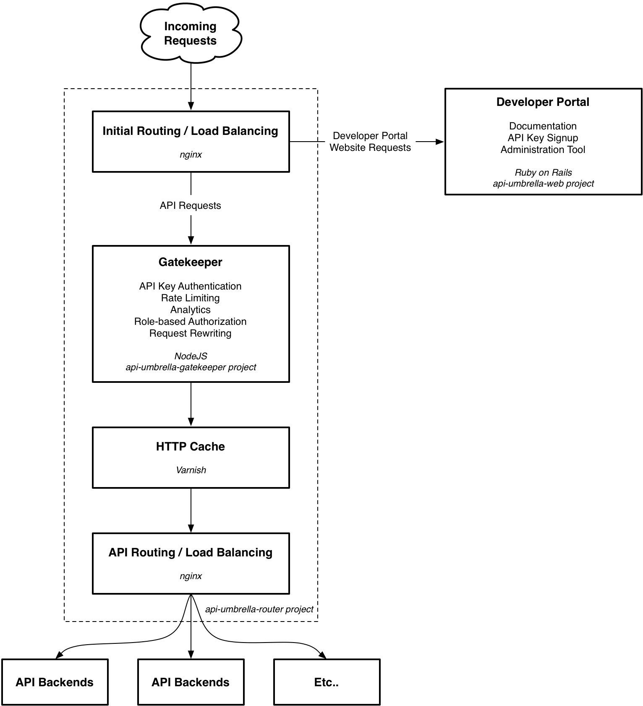
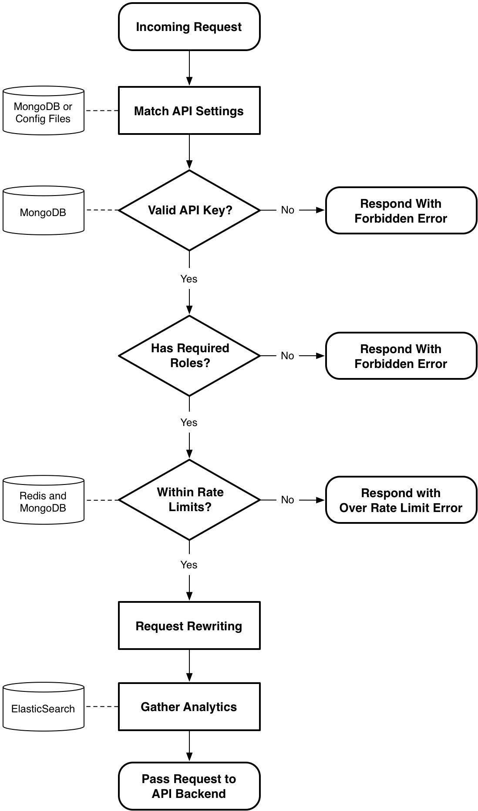

# API Umbrella: Proxy con superpoderes para nuestras APIs

[API Umbrella](http://apiumbrella.io) es un producto open source desarrollado por la NREL (*National Renewable Energy Laboratory*) que actualmente está en uso por el Gobierno de Estados Unidos en [la API su sitio de Open Data](http://api.data.gov). Su función es la de un Proxy que se ubica delante de las aplicaciones que proveen las APIs (los *API backends*) y procesa los requerimientos entrantes para esas APIs con un conjunto de reglas configurables, envía esos requerimientos a los *backends* correspondientes para finalmente enviar al cliente la respuesta. En la superficie es similar a Kong, pero en su arquitectura interna es mucho más compleja, como veremos en breve.

## Licencia

Este producto está publicado bajo licencia MIT: https://github.com/NREL/api-umbrella/blob/master/LICENSE.txt

## Arquitectura interna

Como se puede ver en el diagrama, API Umbrella está compuesto de una serie de elementos que se enlazan secuencialmente, de más externos (cercanos al cliente) a más internos (cercanos a los *backends*):

1. **Ruteo inicial con balanceo de carga:** Un servidor NGINX recibe las peticiones de los clientes y las deriva al Gatekeeper o al sitio para desarrolladores, según sea o no una petición a una API.
2. **Gatekeeper:** Una aplicación hecha en NodeJS recibe peticiones para las APIs, aplica restricciones (autenticación, autorización y *rate limiting*) y transformaciones (reescritura de las peticiones originales), y registra datos de consumo de los servicios para poder utilizarlos con una herramienta de analíticas.
3. **Cache HTTP:** Un servidor Varnish se ubica justo antes del enrutador de las APIs para evitar que éstas reciban *hits* si la respuesta para el servicio solicitado ya se encuentra en esta cache compartida.
4. **Ruteo de servicios con balanceo de carga:** Por último, otro NGINX funciona como enrutador de los *endpoints* reales que cada *backend* provee, pudiendo también balancear la carga entre distintas instancias de cada uno.

En particular, el Gatekeeper merece un gráfico propio describiendo su flujo de trabajo para aplicar restricciones, modificar las peticiones y registrar datos de analíticas:

Del diagrama anterior se desprenden los otros servicios que completan la arquitectura de API Umbrella:

* Bases de datos NoSQL MongoDB para almacenar configuración y claves de acceso (*API keys*).
* Bases de datos clave-valor Redis para almacenar información volátical de los datos de las APIs y los clientes, como datos del *rate limiting*.
* Instancias de Elastic (anteriormente conocido como ElasticSearch), un *datastore* para búsqueda *full text* altamente eficiente, donde se almacenan los datos de acceso a los servicios para poder realizar análisis de los mismos.

## Madurez

Al momento de escritura del presente trabajo, API Umbrella está en desarrollo activo, pero como sus propios creadores indican en [su repositorio de GitHub](https://github.com/NREL/api-umbrella):

> This version is for development only

Es decir, no se recomienda su uso en ambientes de producción aún.

## Conclusión

API Umbrella se ve muy prometedor, es un producto más grande que otros que hemos analizado como Kong, lo cual da soporte para algunas características que no están presentes en el resto, como el uso de Varnish como cache compartida dentro del mismo Proxy, pero presenta un gran inconveniente para considerarlo como una opción en nuestra arquitectura: su nivel de madurez. En el diseño final para la nube de servicios necesitamos utilizar herramientas estables, listas para ser utilizadas en servicios en producción.
