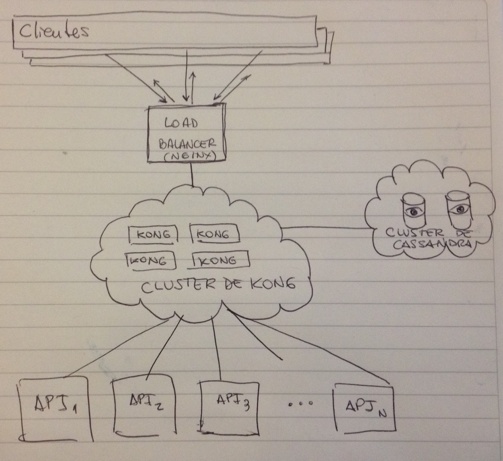

# Kong: Capa de manejo para APIs (OSS)

[Kong](https://getkong.org) es una herramienta desarrollada por Mashape que permite la fácil administración de APIs, centralizando el acceso a las mismas desde uno o más servidores centrales que se encargan de llevar registro de qué APIs/servicios ofrecen, recibir los requerimientos para dichos servicios, y delegar la generación de las respuestas a los *backends* destinados a tal fin.

Kong funciona con una versión modificada de Nginx, haciendo las de reverse proxy y proveyendo una estructura extensible mediante el uso de [plugins](https://getkong.org/plugins/) para brindar funcionalidad adicional a la básica, como ser autenticación, registro en logs, *rate limiting*, caching, por nombrar algunos. Toda su información se almacena en una base de datos [Apache Cassandra](http://cassandra.apache.org/), la cual es a su vez altamente escalable por naturaleza.

Básicamente, Kong se ubica entre los clientes y las instancias *live* de las APIs, recibiendo los requerimientos que van dirigidos a las APIs y enviándolos a la API que corresponde.

## Licencia

Kong está publicado bajo licencia Apache 2.0: https://getkong.org/license/

## Instalación (Docker)

La instalación de [Kong utilizando un *container* de Docker](https://github.com/Mashape/docker-kong) es muy sencilla:

```console
# Bajar imágenes de los containers (sólo la primera vez)
$ docker pull mashape/cassandra
$ docker pull mashape/kong
# Iniciar containers (cassandra y kong)
$ docker run -p 9042:9042 -d --name cassandra mashape/cassandra
$ docker run -p 8000:8000 -p 8001:8001 -d --name kong --link cassandra:cassandra mashape/kong
# Testear que está funcionando:
$ curl http://127.0.0.1:8001
```

## Prueba

Kong atiende en dos puertos diferentes, según las operaciones que se quieran
realizar:

* Puerto `8000`: En este puerto escucha el reverse proxy que acepta los
  requerimientos a las distintas APIs.
* Puerto `8001`: Este puerto es utilizado para exponer una API REST que permite
  realizar operaciones adminsitrativas sobre Kong.

1. Agregar una API a Kong.  
   Agregamos [Mockbin](http://mockbin.com) para probar.

	```console
	$ curl -i -X POST \
	  --url http://localhost:8001/apis/ \
	  --data 'name=mockbin' \
	  --data 'upstream_url=http://mockbin.com/' \
	  --data 'request_host=mockbin.com'
	HTTP/1.1 201 Created
	Date: Wed, 18 Nov 2015 22:15:31 GMT
	Content-Type: application/json; charset=utf-8
	Transfer-Encoding: chunked
	Connection: keep-alive
	Access-Control-Allow-Origin: *
	Server: kong/0.5.3
	
	{"upstream_url":"http:\/\/mockbin.com\/","id":"3a96bb94-1569-402d-c0b4-b63ffca66c13","name":"mockbin","created_at":1447884931000,"request_host":"mockbin.com"}
	```

2. Probar un requerimiento a Mockbin a través de nuestra instalación de Kong.

	```console
	$ curl -i -X GET \
	  --url http://localhost:8000/ \
	  --header 'Host: mockbin.com'
	```

3. Agregar autenticación mediante el plugin [key-auth](https://getkong.org/plugins/key-authentication).  
   Habilitar `key-auth` para la API de Mashape.

	```console
	$ curl -i -X POST \
	  --url http://localhost:8001/apis/mockbin/plugins/ \
	  --data 'name=key-auth'
	HTTP/1.1 201 Created
	Date: Wed, 18 Nov 2015 22:26:53 GMT
	Content-Type: application/json; charset=utf-8
	Transfer-Encoding: chunked
	Connection: keep-alive
	Access-Control-Allow-Origin: *
	Server: kong/0.5.3
	
	{"api_id":"3a96bb94-1569-402d-c0b4-b63ffca66c13","id":"3ae3d85a-8dd1-4280-c22e-af26796bc326","created_at":1447885613000,"enabled":true,"name":"key-auth","config":{"key_names":["apikey"],"hide_credentials":false}}
	```

4. Probar que la autenticación funcione.

	```console
	$ curl -i -X GET \
	  --url http://localhost:8000/ \
	  --header 'Host: mockbin.com'
	HTTP/1.1 401 Unauthorized
	Date: Wed, 18 Nov 2015 22:28:44 GMT
	Content-Type: application/json; charset=utf-8
	Transfer-Encoding: chunked
	Connection: keep-alive
	WWW-Authenticate: Key realm="kong"
	Server: kong/0.5.3
	
	{"message":"No API Key found in headers, body or querystring"}
	```

5. Agregar un *consumer* y asignarle una clave (*key*).

	```console
	$ curl -i -X POST \
	  --url http://localhost:8001/consumers/ \
	  --data "username=test_user"
	HTTP/1.1 201 Created
	Date: Wed, 18 Nov 2015 23:22:10 GMT
	Content-Type: application/json; charset=utf-8
	Transfer-Encoding: chunked
	Connection: keep-alive
	Access-Control-Allow-Origin: *
	Server: kong/0.5.3
	
	{"username":"test_user","created_at":1447888930000,"id":"b936c14d-bb60-4fb5-cf7e-1cfd4dc6a9e0"}
	$ curl -i -X POST \
	  --url http://localhost:8001/consumers/test_user/key-auth/ \
	  --data 'key=t3st-K3Y'
	HTTP/1.1 201 Created
	Date: Wed, 18 Nov 2015 23:24:25 GMT
	Content-Type: application/json; charset=utf-8
	Transfer-Encoding: chunked
	Connection: keep-alive
	Access-Control-Allow-Origin: *
	Server: kong/0.5.3
	
	{"created_at":1447889065000,"consumer_id":"b936c14d-bb60-4fb5-cf7e-1cfd4dc6a9e0","key":"t3st-K3Y","id":"6c9b20b5-5114-486c-c84d-d6b741fd8569"}
	```

6. Probar nuevamente el requerimiento, ahora incluyendo la clave generada.

	```console
	$ curl -i -X GET \
	  --url http://localhost:8000 \
	  --header "Host: mockbin.com" \
	  --header "apikey: t3st-K3Y"
	```

## Funcionalidad agregada: *plugins*

Kong permite extender su funcionalidad y comportamiento básico mediante la adición de *plugins* que brindan variadas funciones. Adicionalmente, en caso que necesitemos agregar alguna funcionalidad que no se encuentra disponible, podemos implementarla nosotros mismos y contribuir nuestro propio *plugin* a la comunidad.

### Autenticación

Kong provee plugins para agregar autenticación a las APIs mediante distintas estrategias:

* **Basic:** Autenticación mediante usuario y contraseña. https://getkong.org/plugins/basic-authentication/
* **Key:** (utilizada en la prueba) Autenticación mediante una API key. https://getkong.org/plugins/key-authentication/
* **OAuth 2.0:** Autenticación mediante el protocolo OAuth 2.0. https://getkong.org/plugins/oauth2-authentication/
* **HMAC:** Permite autenticar la identidad del *consumer* mediante firmas HMAC en los mensajes. https://getkong.org/plugins/hmac-authentication/
* **JWT:** Provee autenticación mediante el uso del estándar JSON Web Tokens (RFC 7519). https://getkong.org/plugins/jwt/

### Seguridad

Estos plugins permiten agregar capas adicionales de seguridad a las APIs:

* **ACL:** Agrega listas de control de acceso para limiter qué *consumers* pueden acceder a qué APIs. https://getkong.org/plugins/acl
* **CORS:** Permite que se realicen requerimientos Cross-Origin con las limitaciones que impongamos. Ideal para clientes JS. https://getkong.org/plugins/cors
* **SSL:** Nos deja agregar certificados SSL a las APIs, tanto individual como globalmente. https://getkong.org/plugins/ssl
* **IP Restriction:** Maneja listas blancas y negras de IPs que pueden realizar requerimientos. https://getkong.org/plugins/ip-restriction

### Control de tráfico

Plugins para controlar el tráfico entrante/saliente:

* **Rate Limiting:** Permite limitar la cantidad de requerimientos que un *consumer* puede hacer a las APIs en un periodo de tiempo dado. https://getkong.org/plugins/rate-limiting
* **Response Rate Limiting:** Limita la cantidad de respuestas que se envían (para tráfico saliente). https://getkong.org/plugins/response-rate-limiting
* **Request Size Limiting:** Bloquea requerimientos cuyo cuerpo exceda un límite que se especifica. https://getkong.org/plugins/request-size-limiting

### Analíticas y monitoreo

Este plugin permite integrar características de analíticas para el tráfico de las APIs y monitoreo de las mismas:

* **Galileo:** Integra el servicio de analíticas y monitoreo de APIs [Galileo](https://getgalileo.io). https://getkong.org/plugins/galileo/

### Transformaciones

Mediante estos plugins, podemos realizar modificaciones a la petición o la respuesta de una API cuando pasa por Kong:

* **Request Transformer:** Modifica la solicitud antes de enviarla a la API correspondiente. https://getkong.org/plugins/request-transformer
* **Response Transformer:** Altera la respuesta obtenida desde la API antes de enviarla al *consumer*. https://getkong.org/plugins/response-transformer

### Logging

Estos plugins permiten escribir a registros (*logs*) las solicitudes y respuestas que pasan por Kong mediante distintas estrategias:

* **TCP:** Envía la información al log mediante una conexión realizada con un servidor que habla el protocolo TCP. https://getkong.org/plugins/tcp-log
* **UDP:** Ídem anterior, excepto que usando protocolo UDP. https://getkong.org/plugins/udp-log
* **HTTP:** Plugin similar a los anteriores, excepto que lo hace contra un servidor que habla HTTP. https://getkong.org/plugins/http-log
* **File:** Escribe la información en archivo local al servidor de Kong. https://getkong.org/plugins/file-log

## Integración en nuestro diseño



En nuestra arquitectura, tendríamos inicialmente un balanceador de carga delante de un cluster de instancias de Kong (junto con su correspondiente cluster de bases Cassandra con al menos dos instancias en réplica) como fachada para todas las peticiones a los servicios de la nube, y detrás de este tendríamos las distintas aplicaciones que proveen los *endpoints* específicos. En caso de necesitar escalar, bastará con agregar más instancias al cluster de Kong y, de ser necesario, también al cluster de bases de datos Cassandra.

En su función de proxy reverso, este producto nos será de gran utilidad al transicionar de la nube actual a la que estamos diseñando en este trabajo: podríamos enrutar todas las peticiones del *hostname* `api2.dataintegration.unlp.edu.ar` a la API anterior y dirigir a las APIs de la nueva arquitectura aquellas que lleguen a `cloud.unlp.edu.ar`. De esta forma, la migración de las aplicaciones cliente a la nueva arquitectura sería gradual.

## Conclusión

Kong es una excelente alternativa al uso de un Enterprise Service Bus, ya que es más liviano, sencillo de configurar y administrar, altamente extensible y personalizable, y cubre las necesidades que tenemos en cuanto a escalabilidad, transparencia, centralización de la gestión y portabilidad.
